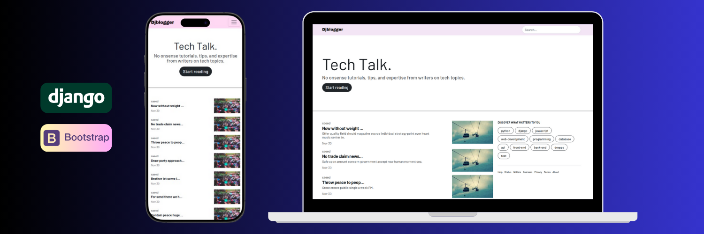
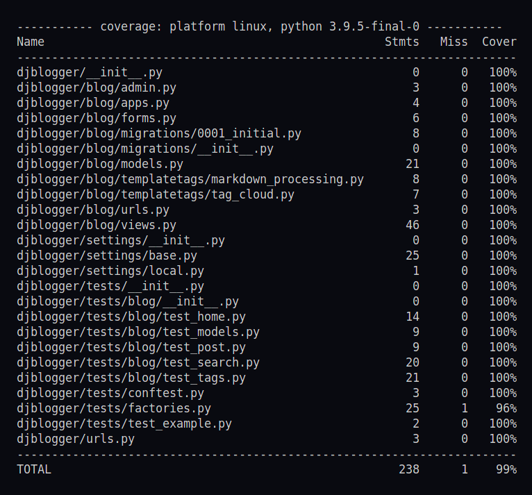
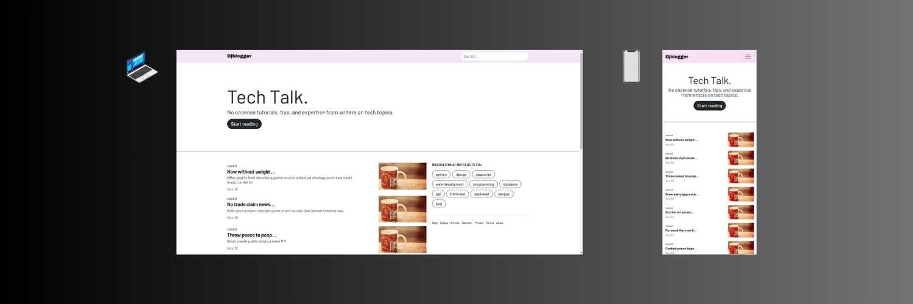
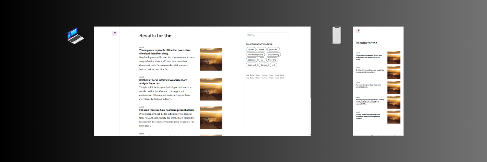

# DjBlogger - A Django Blog Platform
<div align="center">
    
</div>

DjBlogger is a modern blog platform built with Django, featuring infinite scroll, tag-based navigation, search functionality, and a responsive design.
<div align="center">


</div>

## ✨ Key Features
- 📜 Infinite scroll blog posts
- 🏷️ Tag-based categorization
- 🔍 Advanced search functionality
- 📱 Responsive design for seamless usage across devices                            
- ✍️ Markdown support
- 💾 Automated backup system
- ⚡ Seamless HTMX integration
 

## 🛠️ Tech Stack
- Django 4.2
- Python 3.10
- Bootstrap 5
- HTMX
- SQLite (default database)
- pytest for testing
- Markdown for content formatting
- Factory Boy for test data generation


## Key Components

### Models
The core `Post` model (referenced in `blog/models.py`).


### Views
The project implements both class-based and function-based views:
- `HomeView`: Main blog listing with infinite scroll
- `TagListView`: Tag-filtered post listing
- `PostSearchView`: Search functionality
- `post_single`: Individual post display


### Templates
The project uses a hierarchical template structure:
- Base template with common layout
- Reusable components for post listings
- Responsive design breakpoints

### Backup System
The project includes an automated backup system that backs up the database file the `database` file into a directory named `backups` in the root. You can automate this feature using `crontab` in your system. To backup the database use this command:
```bash
 $ python manage.py backup_files
```
If there are more than 5 backup files in the `backups` directory, then the command will delete older backups.
### Testing
- First make a `pytest.ini` file in `djblogger` directory and paste the content     below in it:
    ```nano
    [pytest]
    DJANGO_SETTINGS_MODULE = djblogger.settings.local
    python_files = test_*.py
    ```
    Now you can use the command below:
    ```bash
    $ pytest 
    ```

    Here is the latest result:
    <div align="center">
    
    </div>


- Factory Boy for test data generation
- Coverage reporting
  You can generate more detailed reports for the coverage with this commmand and explore the result in the `htmlcov` directory in the project:
  ```bash
  $ coverage html
  ```


## Installation
1. Clone the repository

2. Create a virtual environment:
    ```bash
    python -m venv venv
    source venv/bin/activate  # On Windows: venv\Scripts\activate
    ```
3. Install dependencies:
    ```bash
    pip install -r requirements.txt
    ```
4. Make a `.env` file in the `djblogger` directory Set up environment variables by filling in the ‍`SECRET_KEY‍` with your secret key and setting the ‍‍`‍DEBUG‍‍` value:
    ```bash
    SECRET_KEY=your_secret_key
    DEBUG=True
    ```
    `note`: there are three files in the `settings` directory:
    
        a. local.py
        b. production.py
        c. base.py
    you by changing the `DEBUG` value in the `.env` file, Django decides which settings file to use for running the server based on the `DEBUG` value.


5. Run migrations:
    ```bash
    python manage.py makemigrations
    python manage.py migrate
    ```

6. Create a superuser:
    ```bash
    python manage.py createsuperuser
    ```

7. Now you can make test data in database with the commands below:
    ```bash
    python manage.py shell
    ```
    Then, enter the following code in the shell to generate test data:
    ```python
    >>> from djblogger.blog.factory import PostFactory
    >>> x = PostFactory.create_batch(100)
    ```

8. run the development server
    ```bash
    python manage.py runserver
    ```


## 📜License
This project is licensed under the MIT License - see the LICENSE file for details.


## 🖼️ Preview
### Home page
The home page features an infinite-scroll list of blog posts, each displaying the title, excerpt, publication date, and associated tags. The clean, modern design ensures optimal readability.

<div align="center">
    
</div>

### Search results page
The search results page dynamically displays filtered posts based on user queries, maintaining the same consistent layout while highlighting matching content.
<div align="center">
    
</div>

### Sort by tag page
When viewing posts by tag, the platform shows all related content in a filtered view, making it easy to explore specific topics or categories.
<div align="center">
    
</div>

<div align="center">
    Made with ❤️ by <a href=https://github.com/saeed-at>saeed-at</a>
</div>
